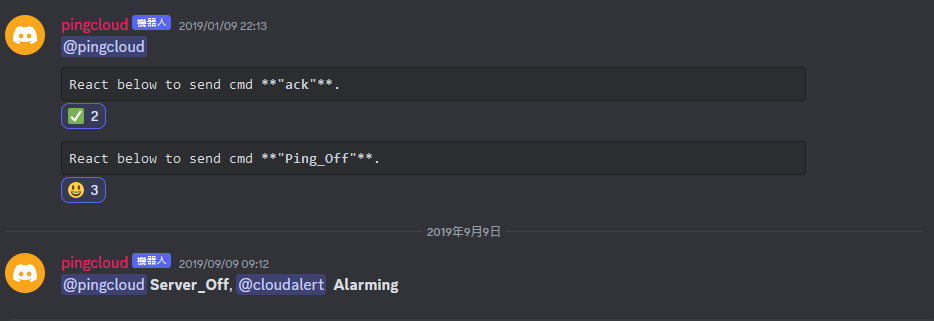

# Node.js pingcloud

Pingcloud is a bot plugin use with Discord (instant messaging application) to monitor uptime of http servers. When i use cloud hosted vitrual machines (VMs), there is no more messages if the VMs is halted. To prevent the downtime of VMs, an extental service is required for monitoring the uptime and sending instant alert. Any other instant messaging applications should work with the idea. Discord is working on cross-platform, and it will run in the web broswer or via app on Mobile.

## Screenshot

## License

[GNU General Public License v3.0](https://www.gnu.org/licenses/gpl-3.0.html)